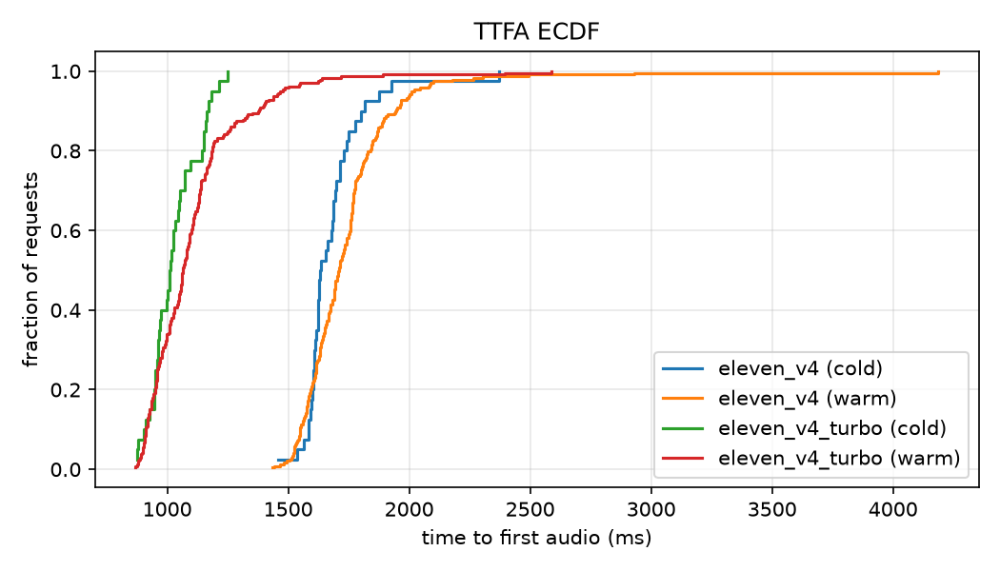
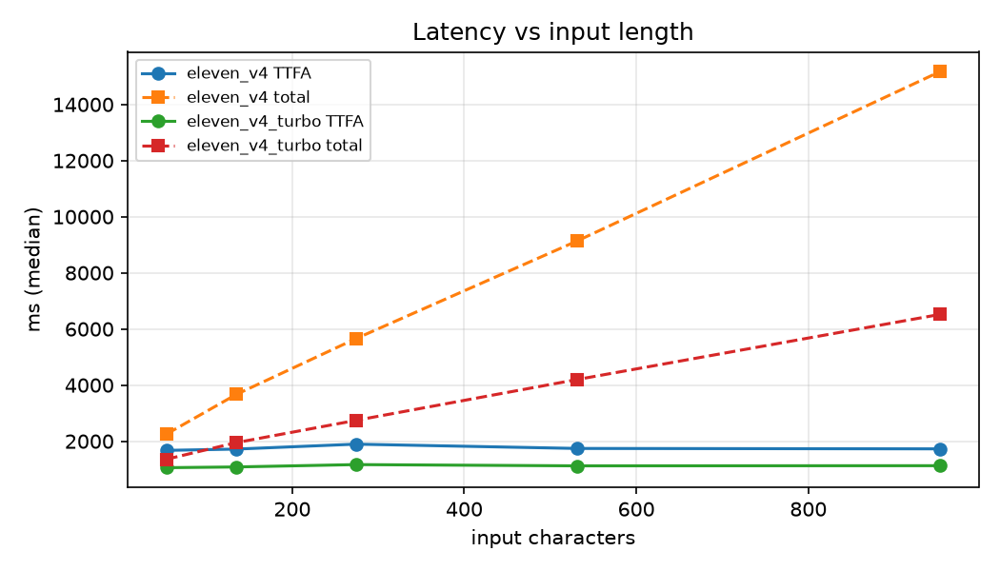
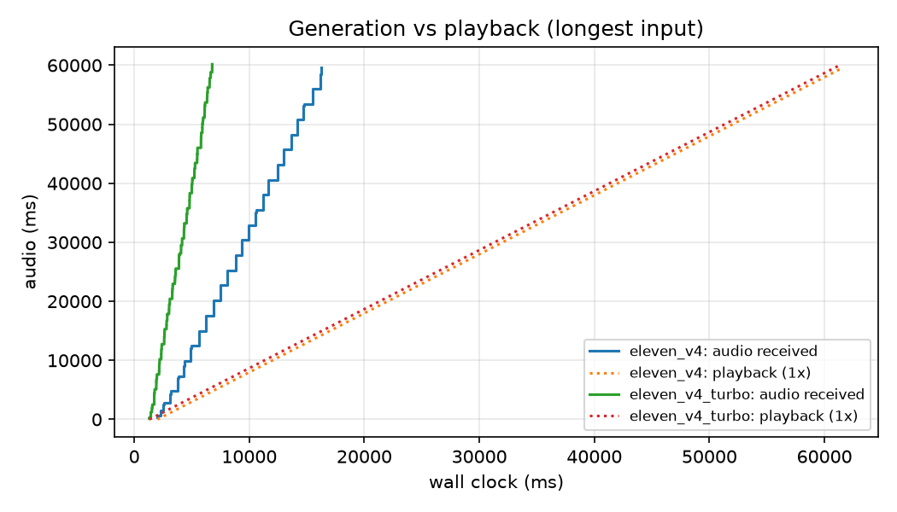

# ElevenLabs Streaming TTS Benchmark

A reproducible harness for measuring what decides whether a voice agent feels human: **how fast audio starts**, **whether playback stays smooth**, **how good it sounds**, and **what it costs**. Every result is a number, not an impression.

It compares `eleven_v4` (expressive) with `eleven_v4_turbo` (low latency) across 558 streaming requests: latency distributions, a length sweep, cold vs warm connections, concurrency, simulated client playback, ASR-based intelligibility, predicted MOS, prosody analysis, speaker consistency and measured cost.

## Key findings

1. **Turbo is ~640 ms faster to first audio, at every percentile.** p50 1059 vs 1695 ms, p95 1422 vs 1942 ms, p99 1860 vs 2459 ms. A random turbo request beats a random v4 request 98% of the time (Mann-Whitney p ≈ 7e-87).
2. **Streaming works as intended.** Time to first audio barely moves with input length (+4 to +7 ms per 100 characters), while total time scales linearly (R² ≥ 0.98). Turbo generates audio about 2.5x faster than v4.
3. **A 100 ms client buffer removes almost all stutter.** Without a buffer, 7% of v4 streams would stall at least once; with 100 ms, ≤1% for both models.
4. **Turbo costs half as much.** 0.055 vs 0.109 credits per character, or 50 vs 100 credits per minute of audio, measured on this account.
5. **No measurable quality difference.** The paired comparison across 13 test sentences found no significant difference in intelligibility, predicted naturalness, pitch range, question intonation, speaking rate or voice identity.
6. **Two pilot observations did not hold up at scale.** The cold-connection penalty was not visible, and the "different emotion on the question" impression is within clip-to-clip variation. See [Pilot vs full run](#pilot-vs-full-run).

**Net:** turbo was faster, half the cost and not measurably worse on any objective metric. Whether v4's extra latency buys anything listeners can hear is being tested with a blind listening study.

## Results

Full generated report: [`results/summary/report.md`](results/summary/report.md)

### Time to first audio (warm connection, single request)

| Model | n | p50 [95% CI] | p95 | p99 | IQR | Real-time factor (p50) |
|---|---|---|---|---|---|---|
| `eleven_v4` | 219 | 1695 [1675–1719] ms | 1942 ms | 2459 ms | 162 ms | 0.53 |
| `eleven_v4_turbo` | 219 | 1059 [1040–1079] ms | 1422 ms | 1860 ms | 183 ms | 0.32 |

<!-- CHART: TTFA distribution (ECDF). File generated by analyze.py -->


The two distributions barely overlap. Turbo's absolute spread (IQR) is similar to v4's, so it is not more consistent in absolute terms. Relative to its median it is actually a little wider (17% vs 10%).

Real-time factor is generation time divided by audio duration. Both models generate faster than playback (below 1.0), so a client that starts playing at the first chunk rarely runs dry.

### Scaling with input length

Length sweep from 10 to 180 words of the same support reply, pooled across runs.

| Model | TTFA growth per 100 chars | TTFA intercept | Total time per 100 chars | Marginal generation speed | R² (total) |
|---|---|---|---|---|---|
| `eleven_v4` | +3.7 ms | 1759 ms | 1424 ms | ~4.6x real time | 0.99 |
| `eleven_v4_turbo` | +6.7 ms | 1114 ms | 565 ms | ~11.6x real time | 0.98 |

<!-- CHART: median TTFA and total time vs input length. File generated by analyze.py -->


Going from 54 to 953 characters adds only about 35–65 ms to first audio, so time to first audio depends on the model, not on how much the agent has to say. 100 characters is about 6.6 s of speech (both models speak at about 15.2 characters per second of audio); v4 generates that in 1.4 s and turbo in 0.57 s.

### Playback stalls (simulated client)

Audio is requested as raw 16 kHz PCM, so each chunk's audio duration is exact. Chunk arrival times are replayed against real-time playback to count buffer underruns at different client jitter-buffer sizes.

| Model | Streams with ≥1 stall, 0 ms buffer | 100 ms buffer | 250 ms buffer |
|---|---|---|---|
| `eleven_v4` | 7% | 1% | 1% |
| `eleven_v4_turbo` | 1% | 0% | 0% |

<!-- CHART: audio received vs audio played, longest input. File generated by analyze.py -->


A 100 ms buffer is enough for both models in practice. v4 keeps a small tail (1% even at 250 ms), consistent with its lower generation headroom.

### Connection setup and concurrency

| Model | Warm p50 | Cold p50 (new TCP+TLS per request) | 3 concurrent requests p50 |
|---|---|---|---|
| `eleven_v4` | 1695 ms | 1634 [1620–1686] ms | 1966 [1904–2005] ms |
| `eleven_v4_turbo` | 1059 ms | 1011 [971–1047] ms | 1289 [1107–1418] ms |

- **Cold connections were not slower.** A new connection per request did not add measurable latency (n=40 per model). A plausible explanation is that TLS terminates at a nearby edge, making the handshake cheap compared with inference time; the setup cost is within the noise here.
- **Concurrency adds ~230–270 ms.** With 3 simultaneous requests, p50 rose for both models and the confidence intervals don't overlap with the single-request case. This points to queuing or per-account throttling. The sample is small (n=20 per model), and the items differ slightly from the warm run, but time to first audio barely depends on length, so the item mix can't explain a gap this size.

### Cost

Measured with the account credit counter before and after single-model runs on the Starter plan, October 2026. These are observed rates for this account, not list pricing.

| Model | Credits / 1K chars | Credits / min of audio | TTFA p50 |
|---|---|---|---|
| `eleven_v4` | 109 | 99.6 | 1695 ms |
| `eleven_v4_turbo` | 55 | 50.2 | 1059 ms |

### Quality

208 clips: 13 sentences × 2 models × 8 repetitions. Each metric is averaged per sentence, then the two models are compared on the same sentence (mean difference v4 − turbo, bootstrap 95% CI, Wilcoxon signed-rank).

| Metric | v4 | turbo | Paired difference [95% CI] | p |
|---|---|---|---|---|
| Word error rate (Whisper large-v3) | 0.064 | 0.067 | −0.003 [−0.010, 0.003] | 0.75 |
| Character error rate | 0.035 | 0.037 | −0.002 [−0.008, 0.002] | 1.00 |
| UTMOS predicted naturalness (1–5) | 3.74 | 3.80 | −0.059 [−0.125, 0.000] | 0.13 |
| Pitch range (semitones) | 16.92 | 16.93 | −0.015 [−0.256, 0.249] | 0.95 |
| Question final rise (semitones) | −4.79 | −5.44 | +0.43 [−0.15, 1.01] | 0.17 |
| Speech rate (words/s) | 2.638 | 2.634 | +0.004 [−0.002, 0.010] | 0.19 |
| Speaker similarity to voice centroid | 0.946 | 0.943 | +0.003 [−0.000, 0.006] | 0.19 |

Notes from the per-category breakdown (full table in the generated report):

- **Errors are shared, not model-specific.** Word error rate is zero on most categories for both models. The non-zero ones are dates/IDs (~0.22), numbers (~0.24) and Hinglish (~0.31–0.35), with near-identical values for both models. That pattern points to scoring artifacts rather than TTS mistakes: for example, "03/10/2026" has several valid spoken forms, and Whisper writes numbers differently from the reference. Hinglish is also transcribed with an English-only ASR setting.
- **Questions end falling for both models.** Mean final pitch is about 5 semitones below the utterance median, with a clip-to-clip spread of about 5 semitones. The difference between models (0.4 semitones) is roughly a tenth of that within-model variation. A single pair of clips, as in the pilot, can easily show a difference that the model doesn't systematically have.
- **UTMOS is lowest on Hinglish and empathy** (about 3.2–3.5 for both models). UTMOS is trained on English speech, so Hinglish scores are not meaningful as naturalness ratings.
- **The models are strikingly similar acoustically.** Speaking rate matches to within 0.2% and pitch range to within 0.1 semitone. Turbo looks like the same voice and prosody model optimised for serving, not a different-sounding one.

### Listening test

<!-- RESULTS PENDING: paste the output of `python make_ab_test.py results/<quality-run> --score` here once n >= 5 listeners -->
Blind A/B results are being collected: same sentence, random order, rated for naturalness, fit to the intended tone, and perceived emotion. Preference rates with binomial confidence intervals will be added once at least 5 listeners have responded.

## Pilot vs full run

The project began as a 4-round pilot (MP3 output, one 4-sentence text, round 0 discarded):

| | Pilot | Full run |
|---|---|---|
| v4 TTFA (warm) | ~920–1610 ms | p50 1695 ms, n=219 |
| turbo TTFA (warm) | ~350–450 ms | p50 1059 ms, n=219 |
| Speed ratio | 2–3x | ~1.6x (constant ~640 ms gap) |
| Cold-start penalty | ~2.1 s on the first request | Not observed (n=40) |
| Quality | Same pronunciation; question "sounded different" | No measurable difference |

The full run's turbo latency is much higher than the pilot's, and this is not yet explained. Candidate causes: the output format (pilot MP3, full run raw PCM), time of day and server load (full run 21:00–21:40 IST), or a one-off fast period during the pilot. An output-format experiment is the next step.

## Hypotheses

| # | Hypothesis | Status |
|---|---|---|
| 1 | Turbo's TTFA advantage holds at p95, not just p50, with tighter jitter | **Partly confirmed:** faster at every percentile; jitter not tighter |
| 2 | Streaming TTFA is roughly flat in input length; total time scales linearly | **Confirmed** |
| 3 | A small client buffer (≤250 ms) removes stalls for both models | **Confirmed:** 100 ms suffices; v4 keeps a 1% tail |
| 4 | Word error rate is the same for both; differences appear in prosody and listener preference | **WER confirmed equal; no prosody difference detected; listener preference pending** |
| 5 | Per-turn routing (fast model for informational turns, expressive model for emotional ones) is sound | **Weakened:** turbo matched v4 on every objective measure, so routing is only justified if listeners prefer v4 on emotional turns |
| 6 | A cold connection adds significant first-request latency | **Not supported** in this setup |

## Method

### Pipeline

```
corpus.jsonl ──► bench.py ──► results/<run>/latency.jsonl + audio/*.wav
                                   │
                                   ├─► eval_quality.py ──► quality.jsonl
                                   ├─► make_ab_test.py ──► ab_test.html ──► listener preference scores
                                   └─► analyze.py ──────► report.md + charts
```

### Latency metrics

| Metric | Definition |
|---|---|
| TTFA | Time from request start to the first audio chunk. p50 is reported with a bootstrap 95% CI, alongside p95, p99 (n ≥ 100) and IQR. |
| Real-time factor | Total generation time ÷ audio duration. Below 1.0 means generation outruns playback. |
| Stall rate | Share of streams with at least one playback underrun, given a client that starts playing after a 0 / 100 / 250 ms jitter buffer. Exact because the audio is raw PCM. |
| Length scaling | Linear fit of TTFA and total time against input characters. |
| Cold vs warm | Warm runs reuse one connection after a discarded warm-up; cold runs open a new TCP+TLS connection per request. |

Each round is shuffled across models and items so time-of-day drift and server load don't favour whichever model runs first.

### Quality metrics

| Dimension | Method |
|---|---|
| Intelligibility | Whisper large-v3 transcribes each clip; WER and CER against the input text after Whisper's text normaliser |
| Naturalness | UTMOS22 (strong), a neural predictor of listener MOS on a 1–5 scale; English only |
| Question intonation | Praat F0 contour: pitch of the final 150 ms relative to the utterance median, and slope over the final 500 ms |
| Expressiveness | Pitch range (p5–p95 in semitones), pitch SD, energy SD |
| Pacing | Speech rate, pause count and length, leading silence |
| Voice consistency | Resemblyzer speaker-embedding cosine similarity to the voice's centroid across all clips |
| Listener preference | Blind randomised A/B test, scored with a binomial test and 95% CI |

### Test corpus

`corpus.jsonl` has two suites:

- **latency**: a 10 → 180 word length sweep of one support reply, plus a short acknowledgement and an informational turn.
- **quality**: open and closed questions, apology, empathy, excitement, numbers and OTPs, dates and IDs, Indian names and places, acronyms and URLs, Hinglish, and Hindi.

### Environment

| | |
|---|---|
| Date | 7 October 2026 |
| Client location | India, residential connection |
| Plan | ElevenLabs Starter |
| Voice | one voice, same for both models |
| Requests | 558 TTS requests across 6 runs, plus 2 single-model cost runs |
| ASR | faster-whisper `large-v3`, float16, NVIDIA RTX 3060 Laptop GPU (6 GB) |
| CPU | AMD Ryzen 7 5800H |

## Setup

```powershell
python -m venv .venv; .venv\Scripts\Activate.ps1
pip install -r requirements.txt          # CPU-only; see "Optional: GPU transcription" below
$env:ELEVENLABS_API_KEY = "your-key"
$env:ELEVENLABS_VOICE_ID = "your-voice-id"
python bench.py --list-models
```

## Reproducing the runs

Each `bench.py` run prints the character count and asks for confirmation (`--yes` skips the prompt).

```powershell
python bench.py --suite latency --ids q_ack q_info len_010 --reps 25 --tag dist
python bench.py --suite latency --ids len_025 len_050 len_100 len_180 --reps 3 --tag sweep
python bench.py --suite latency --ids len_025 len_050 len_100 len_180 --reps 7 --tag sweep2
python bench.py --suite latency --ids q_ack q_info --reps 20 --conn cold --tag cold
python bench.py --suite latency --ids q_info len_050 --reps 10 --concurrency 3 --tag conc3
python bench.py --suite quality --reps 8 --tag quality

python eval_quality.py results/<quality-run> --asr-device cuda --asr-model large-v3

python analyze.py results/<dist> results/<sweep> results/<sweep2> results/<cold> results/<conc3> results/<quality> `
  --out results/summary --cost eleven_v4=0.109 eleven_v4_turbo=0.055
```

### Measuring cost

Read the account counter before and after a single-model run. Include the discarded warm-up request in the character count.

```powershell
python -c "import os,requests; print(requests.get('https://api.elevenlabs.io/v1/user/subscription', headers={'xi-api-key':os.environ['ELEVENLABS_API_KEY']}).json()['character_count'])"
```

### Blind listening test

```powershell
python make_ab_test.py results/<quality-run>            # writes ab_test.html and ab_key.json
python make_ab_test.py results/<quality-run> --score    # after saving replies as ab_<initials>.json
```

`ab_key.json` maps clips to models and is excluded from git so listeners stay blind. Back it up: replies can't be scored without it.

### Optional: GPU transcription

Whisper runs on CPU by default, which is fast enough for a few hundred short clips with the `small` model. A GPU is worth it for `large-v3` (more accurate transcripts, so fewer ASR mistakes get counted as TTS mistakes) or much larger runs. It needs an NVIDIA GPU with a recent driver; the CUDA 12 runtime libraries install from pip, so no system-wide CUDA Toolkit is required.

```powershell
pip install -r requirements-cuda.txt
```

On Windows, `eval_quality.py` registers the pip-installed DLL folders itself when `--asr-device cuda` is passed, so no PATH changes are needed. On Linux, set the library path once per shell:

```bash
export LD_LIBRARY_PATH=$(python -c 'import os, nvidia.cublas.lib, nvidia.cudnn.lib; print(os.path.dirname(nvidia.cublas.lib.__file__) + ":" + os.path.dirname(nvidia.cudnn.lib.__file__))')
```

```powershell
python eval_quality.py results/<run> --asr-device cuda --asr-model large-v3
```

`libcublas.so.12` not found on Linux means the `LD_LIBRARY_PATH` step was skipped or the shell was reopened. Without `--asr-device cuda`, everything runs on CPU and none of this applies. Record the Whisper model size alongside results, since WER depends on it.

## Limitations

- **One location, one evening, one voice.** Absolute latency includes network distance from India and the server load at that time. The model comparison is fair because runs were interleaved, but absolute numbers may not generalise.
- **The "estimated server TTFA" column in the generated report is not valid.** The baseline call it subtracts (`/v1/user/subscription`) takes about 1.5 s, so it measures API overhead rather than network round trip, which produces negative values for turbo. It should be ignored until the baseline is replaced with a TCP-connect timing.
- **Concurrency and cold runs are small** (n=20–40 per model) and use a subset of items.
- **The objective metrics describe acoustics, not preference.** Identical pitch statistics don't prove listeners hear no difference; the A/B test is the arbiter.
- **WER on dates, numbers and Hinglish is dominated by scoring artifacts.** UTMOS is not meaningful for Hindi or Hinglish.
- **Cost rates were observed on one account and plan** and may not match list pricing.

## Next steps

- Output-format experiment (MP3 vs PCM) to explain the gap between pilot and full-run turbo latency.
- Replace the RTT baseline with a TCP-connect timing so network and server time can be separated.
- Repeat the latency runs at several times of day.
- Add a Flash tier to get a three-point speed/quality/cost curve.
- Test WebSocket input streaming, where text arrives token by token as it would from an LLM.
- Repeat the quality suite with several voices.
- Add listening-test results.
